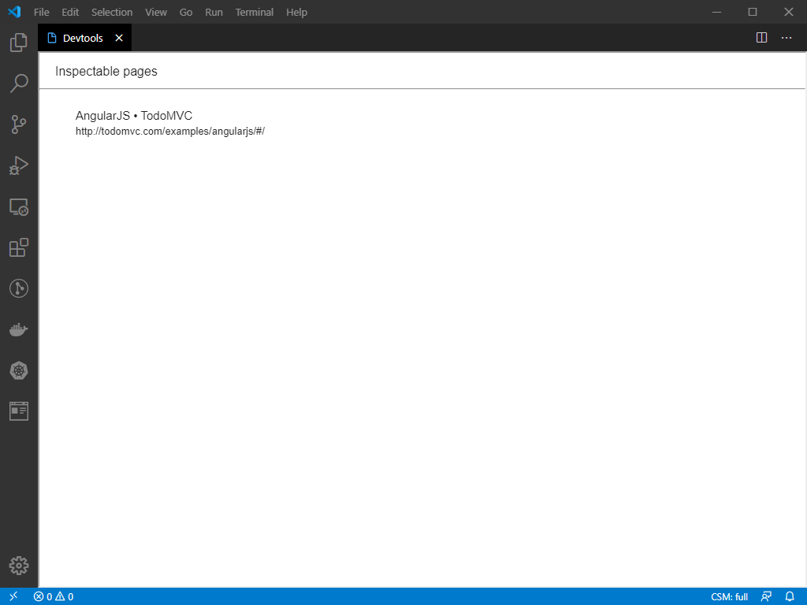
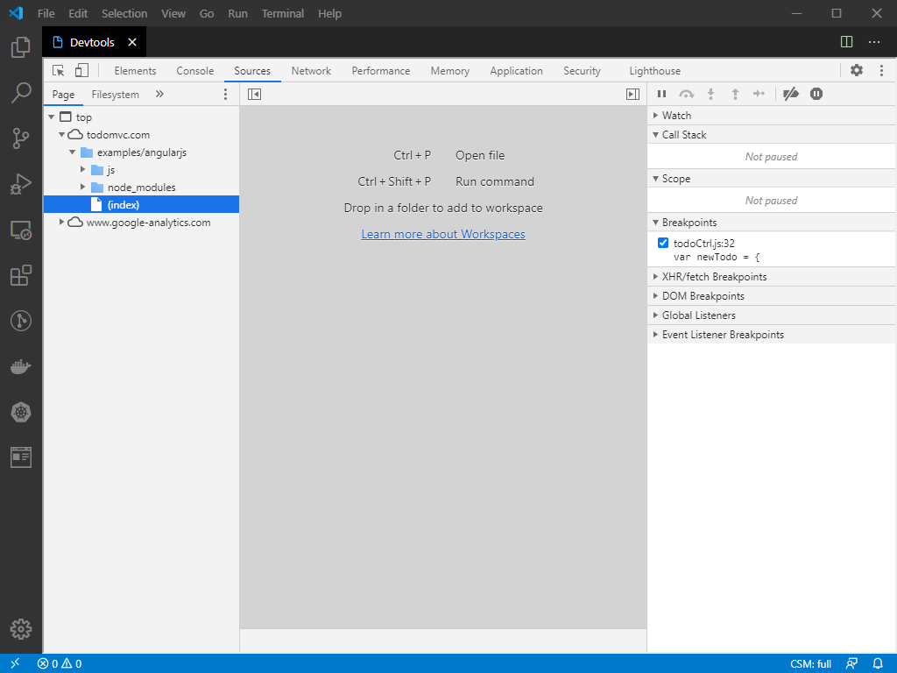

# vscode-devtools

Chrome Devtools inside VSCode using Webview+iframe

# How to use?

Run chrome instance with

```
chrome --remote-debugging-port=9222
```

Install this extension.

Invoke Devtools command via command palette. The list of debug targets is shown.



Select the target and the Chrome Devtools will load in a iframe in the Webview based editor.



This is a starting point. I am exploring possibilites of integration with VSCode. For example:

* Open resource in VSCode integration
* Workspace mapping

Of course VSCode has bultin debugger for JavaScript (based languages).
